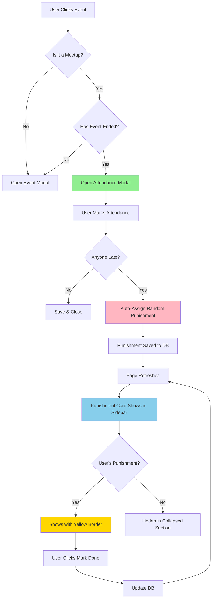

## Component Interaction Diagram

```
┌─────────────────────────────────────────────────────────────┐
│                        CalendarApp                          │
│  ┌──────────────────────────────────────────────────────┐  │
│  │  State Management:                                    │  │
│  │  - selectedEvent                                      │  │
│  │  - showAttendanceModal                               │  │
│  │  - showEventModal                                    │  │
│  │  - allPunishments (extracted from events)            │  │
│  └──────────────────────────────────────────────────────┘  │
│                                                              │
│  ┌────────────────┐         ┌─────────────────────────┐    │
│  │   Sidebar      │         │    CalendarGrid         │    │
│  │                │         │                         │    │
│  │  ┌──────────┐  │         │  ┌─────────────────┐   │    │
│  │  │Punishment│  │         │  │  MonthView      │   │    │
│  │  │  Card    │  │         │  │  onEventClick() │   │    │
│  │  │          │◄─┼─────────┼──┤  ↓              │   │    │
│  │  │ Pending: │  │         │  │  WeekView       │   │    │
│  │  │ [●]      │  │         │  │  onEventClick() │   │    │
│  │  │ [Mark    │  │         │  │  ↓              │   │    │
│  │  │  Done]   │  │         │  │  DayView        │   │    │
│  │  │          │  │         │  │  onEventClick() │   │    │
│  │  │Completed:│  │         │  └─────────────────┘   │    │
│  │  │ [✓]      │  │         └─────────────────────────┘    │
│  │  └──────────┘  │                     │                  │
│  └────────────────┘                     │                  │
│                                          ↓                  │
│                              ┌────────────────────┐         │
│                              │ handleEventClick() │         │
│                              └────────────────────┘         │
│                                          │                  │
│                    ┌─────────────────────┴─────────────┐    │
│                    ↓                                   ↓    │
│          ┌──────────────────┐               ┌─────────────┐│
│          │ AttendanceModal  │               │ EventModal  ││
│          │ (Past Meetups)   │               │ (Others)    ││
│          │                  │               │             ││
│          │ [User A] ☑ Late  │               │ Edit Event  ││
│          │ [User B] ☐ On    │               │ Delete      ││
│          │ [Save]           │               │ [Save]      ││
│          └──────────────────┘               └─────────────┘│
│                    │                                        │
│                    ↓                                        │
│          ┌──────────────────┐                               │
│          │ markAttendance() │                               │
│          │ assignPunishment()│                              │
│          └──────────────────┘                               │
└─────────────────────────────────────────────────────────────┘
```

## Data Flow Diagram

```
┌─────────────┐
│  Supabase   │
│  Database   │
└──────┬──────┘
       │
       │ getCalendarDetails()
       ↓
┌─────────────────────────────────────────┐
│           page.tsx                      │
│                                         │
│  events.map(event => ({                │
│    punishments: event_punishments.map( │
│      pun => camelCase transform        │
│    )                                    │
│  }))                                    │
└──────┬──────────────────────────────────┘
       │
       │ Props: events, currentUserId
       ↓
┌─────────────────────────────────────────┐
│        calendar-app.tsx                 │
│                                         │
│  const allPunishments = events.flatMap( │
│    event => event.punishments.map(     │
│      p => snake_case transform         │
│    )                                    │
│  )                                      │
└──────┬──────────────────────────────────┘
       │
       │ Props: punishments, currentUserId, onCompletePunishment
       ↓
┌─────────────────────────────────────────┐
│           sidebar.tsx                   │
│                                         │
│  <PunishmentCard                        │
│    punishments={allPunishments}         │
│    currentUserId={currentUserId}        │
│    onCompletePunishment={handler}       │
│  />                                     │
└──────┬──────────────────────────────────┘
       │
       │ Filter: punishments.filter(p => p.user_id === currentUserId)
       ↓
┌─────────────────────────────────────────┐
│       punishment-card.tsx               │
│                                         │
│  myPunishments.filter(p => !p.completed)│
│    → Pending section with Mark Done    │
│                                         │
│  myPunishments.filter(p => p.completed) │
│    → Completed section with ✓          │
└─────────────────────────────────────────┘
```

## State Flow on Event Click

```
Initial State:
┌───────────────────────────────┐
│ showEventModal = false        │
│ showAttendanceModal = false   │
│ selectedEvent = null          │
└───────────────────────────────┘

User Clicks Past Meetup:
┌───────────────────────────────┐
│ 1. Find originalEvent by ID   │
│ 2. setSelectedEvent(event)    │
│ 3. Check: type === "meetup"?  │
│ 4. Check: endTime < now?      │
│ 5. If both true:              │
│    setShowAttendanceModal(T)  │ ✅
│    setShowEventModal(F)       │ ✅
│ 6. Else:                      │
│    setShowEventModal(T)       │
│    setShowAttendanceModal(F)  │
└───────────────────────────────┘

Final State (Past Meetup):
┌───────────────────────────────┐
│ showEventModal = false        │
│ showAttendanceModal = TRUE    │ ✅
│ selectedEvent = {event data}  │
└───────────────────────────────┘

Final State (Future/Personal):
┌───────────────────────────────┐
│ showEventModal = TRUE         │ ✅
│ showAttendanceModal = false   │
│ selectedEvent = {event data}  │
└───────────────────────────────┘
```

## Database Schema

```
┌─────────────────────────────────────────────────────────────┐
│                           events                            │
├──────────────┬──────────────────────────────────────────────┤
│ id (PK)      │ uuid                                         │
│ calendar_id  │ uuid → calendars(id)                        │
│ user_id      │ uuid → profiles(id)                         │
│ title        │ text                                         │
│ start_time   │ timestamptz                                  │
│ end_time     │ timestamptz ◄── Used to check if past       │
│ type         │ text ('personal' | 'meetup')                │
└──────────────┴──────────────────────────────────────────────┘
              │
              │ Has many
              ↓
┌─────────────────────────────────────────────────────────────┐
│                   meetup_participants                       │
├──────────────┬──────────────────────────────────────────────┤
│ id (PK)      │ uuid                                         │
│ event_id     │ uuid → events(id)                           │
│ user_id      │ uuid → profiles(id)                         │
│ was_late     │ boolean ◄── Determines punishment           │
│ marked_at    │ timestamptz                                  │
└──────────────┴──────────────────────────────────────────────┘
              │
              │ Triggers punishment creation
              ↓
┌─────────────────────────────────────────────────────────────┐
│                    event_punishments                        │
├──────────────┬──────────────────────────────────────────────┤
│ id (PK)      │ uuid                                         │
│ event_id     │ uuid → events(id)                           │
│ user_id      │ uuid → profiles(id)                         │
│ punishment   │ text (random from PUNISHMENT_LIST)          │
│ assigned_at  │ timestamptz                                  │
│ completed    │ boolean ◄── Updated by Mark Done            │
│ completed_at │ timestamptz                                  │
└──────────────┴──────────────────────────────────────────────┘
```
